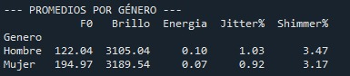
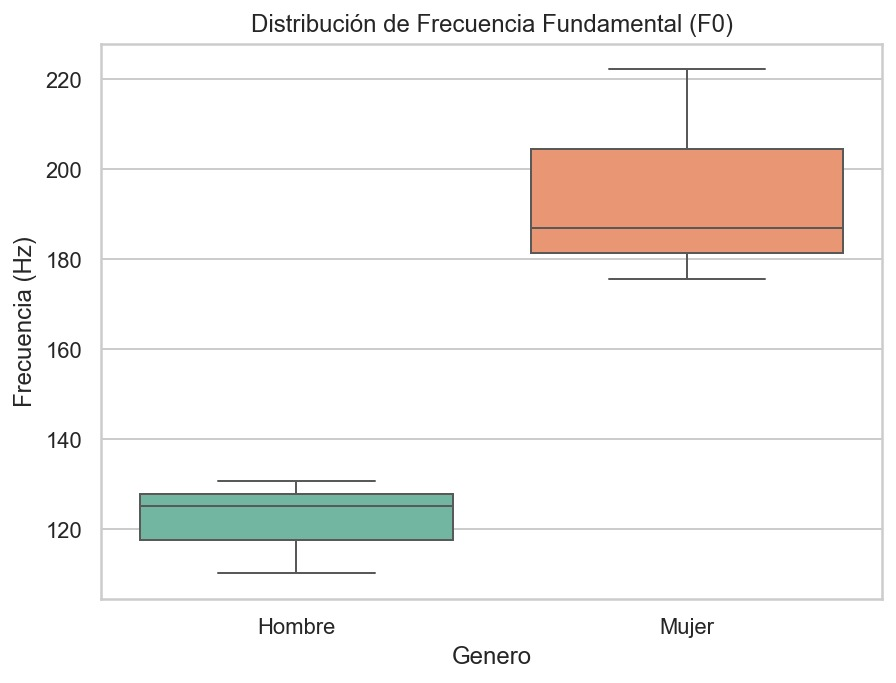
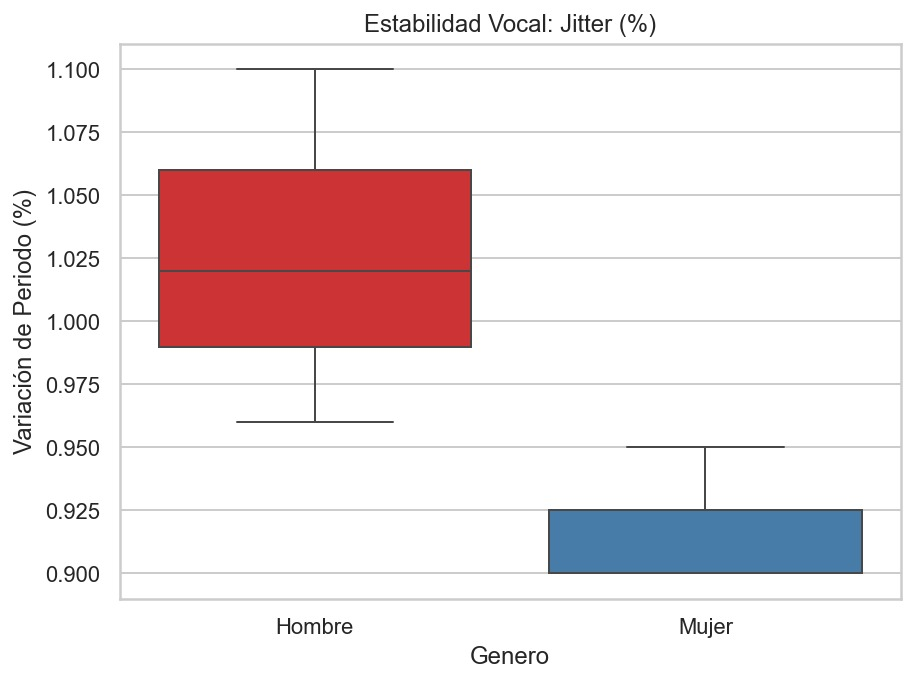
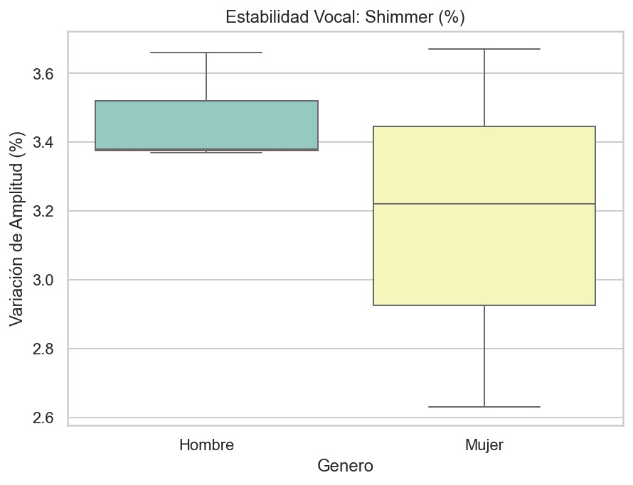
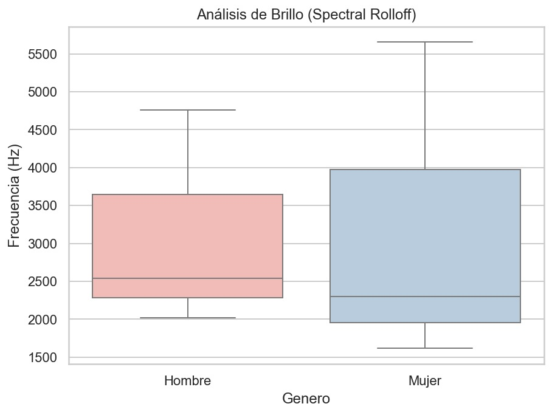
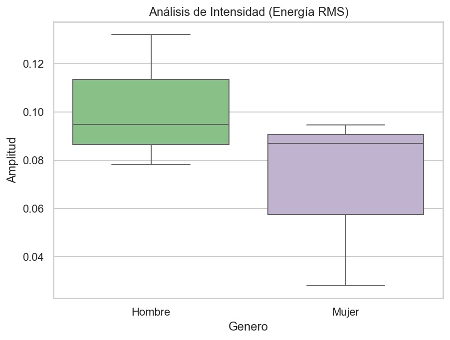

# *Análisis espectral de la voz*

## *Contexto historico*

Las características espectrales desempeñan un papel fundamental en el análisis y la comprensión de las señales de voz. Éstas capturan las características de frecuencia de los sonidos del habla, lo que permite comprender los patrones fonéticos, los rasgos del hablante y los matices lingüísticos. Algunas de las características espectrales clave que se utilizan habitualmente en el análisis de señales de voz son las siguientes:
- El centroide espectral: representa el centro de masa del espectro e indica la frecuencia promedio de la señal de voz. Ofrece información sobre el tono y el timbre percibidos de los sonidos del habla.

- La frecuencia fundamental (F0): es la frecuencia más baja y principal de un sonido, la que define su altura tonal.

- La frecuencia media: se refiere a una banda específica del espectro electromagnético o un rango específico de frecuencias.
  
- El Jitter y el shimmer: ambas son medidas de inestabilidad en señales periódicas (como la voz), pero se diferencian en lo que miden: jitter es la variación de la frecuencia (tono) ciclo a ciclo, mientras que shimmer es la variación de la amplitud (volumen) ciclo a ciclo, ambas causadas por la irregular vibración de las cuerdas vocales y percibidas como aspereza o temblor en la voz.

## *Objetivos*

### *Objetivo general:*
Emplear técnicas de análisis espectral para la diferenciación o clasificación de señales de voz según el género.

### *Objetivos especificos:*

- Capturar y procesar señales de voz masculinas y femeninas.

- Aplicar la Transformada de Fourier como herramienta de análisis espectral de la voz.

- Extraer parámetros característicos de la señal de voz: frecuencia fundamental, frecuencia media, brillo, intensidad, jitter y shimmer.

- Comparar las diferencias principales entre señales de voz de hombres y mujeres a partir de su análisis en frecuencia.

- Desarrollar conclusiones sobre el comportamiento espectral de la voz humana en función del género.

## *Adquisición de datos*

| Parámetro                          | Valor                              |
|-----------------------------------|------------------------------------|
| Frecuencia de Muestreo (Fs)       | 44 KHz                                 |
| Resolución                        |  16-bit PCM                             |
| Nivel de entrada                  |                                    |
| Entorno                           |          Entorno con ruido de fondo moderado. Se observa un piso de ruido en los silencios de la señal.                          |

***Nota:*** Se grabaron 6 señales (3 hombres, 3 mujeres) con la misma frase de ~3 segundos en formato .wav. 

## *Procesamiento de datos (codigo en Python)*

Este código tiene como objetivo realizar un análisis completo de señales de voz en formato `.wav`, permitiendo extraer características espectrales y calcular métricas importantes como el jitter y el shimmer, ampliamente utilizadas en el análisis biomédico de la calidad vocal.

Inicialmente, se importan las librerías necesarias para el procesamiento numérico, análisis de audio, visualización de señales, manejo de archivos y filtrado digital:

```python
import numpy as np
import matplotlib.pyplot as plt
import librosa
import os
import pandas as pd
from scipy.signal import butter, lfilter, find_peaks
```

A continuación, se define la lista de archivos de audio que serán procesados
```python
archivos = ['HOMBRE1.wav', 'HOMBRE2.wav', 'HOMBRE3.wav', 
            'MUJER1.wav', 'MUJER2.wav', 'MUJER3.wav']
```

Posteriormente, se implementa una función de filtro pasabanda tipo Butterworth, el cual permite conservar únicamente las frecuencias relevantes de la voz humana:
```python
def filtro_pasabanda(data, lowcut, highcut, fs, order=5):
    nyq = 0.5 * fs
    low = lowcut / nyq
    high = highcut / nyq
    b, a = butter(order, [low, high], btype='band')
    return lfilter(b, a, data)
```
En la Parte A, se carga la señal original y su frecuencia de muestreo:

```python
y_original, sr = librosa.load(nombre, sr=None)
```
Se calcula el número de muestras y el vector de tiempo:

```python
n = len(y_original)
t = np.linspace(0, n/sr, n)
```
Se clasifica el género del hablante:

```python
genero = 'Hombre' if 'HOM' in nombre.upper() else 'Mujer'
```
Se extraen las características principales de la señal.

- Frecuencia fundamental:

```python
f0 = np.nanmean(librosa.yin(y_original, fmin=80, fmax=450))
```
- Frecuencia media:
```python
f_media = np.mean(librosa.feature.spectral_centroid(y=y_original, sr=sr))
```
- Brillo:
```python
brillo = np.mean(librosa.feature.spectral_rolloff(y=y_original, sr=sr, roll_percent=0.85))
```
- Energía:
```python
energia = np.mean(librosa.feature.rms(y=y_original))
```
Se calcula la Transformada de Fourier para analizar la señal en el dominio de la frecuencia:
```python
fft_mag = np.abs(np.fft.rfft(y_original))
freqs = np.fft.rfftfreq(n, 1/sr)
```
En la Parte B, primero se filtra la señal según el rango de frecuencias de la voz:
```python
f_min, f_max = (80, 400) if genero == 'Hombre' else (150, 500)
y_filtrada_completa = filtro_pasabanda(y_original, f_min, f_max, sr)
```
Luego se selecciona un segmento específico de la señal filtrada:
```python
start, end = int(t_in * sr), int(t_out * sr)
y_filtrada_segmento = y_filtrada_completa[start:end]
```
Se normaliza la señal para evitar efectos de escala:
```python
y_seg_norm = y_filtrada_segmento / np.max(np.abs(y_filtrada_segmento))
```
Se detectan los picos correspondientes a cada ciclo de la señal:
```python
picos, _ = find_peaks(y_seg_norm, distance=sr/250, height=0.5)
```
A partir de los picos se calculan los periodos y amplitudes:
```python
Ti = np.diff(picos / sr)
Ai = y_seg_norm[picos]
```
Se calcula el jitter que mide la variación del periodo entre ciclos:
```python
jitter_abs = (1/(len(Ti)-1)) * np.sum(np.abs(Ti[:-1] - Ti[1:]))
jitter_rel = (jitter_abs / np.mean(Ti)) * 100
```
Y se calcula el shimmer que mide la variación de la amplitud entre ciclos:
```python
shimmer_abs = (1/(len(Ai)-1)) * np.sum(np.abs(Ai[:-1] - Ai[1:]))
shimmer_rel = (shimmer_abs / np.mean(Ai)) * 100
```
Finalmente, los resultados se almacenan en estructuras tipo DataFrame:
```python
df_a = pd.DataFrame(resultados_a)
df_b = pd.DataFrame(resultados_b)
```

## *Resultados*


A continuación se presentan las gráficas de las seis señales de voz en el dominio del tiempo.
<p align="center">

</p>
<p align="center">
<em>Gráfica 1. Gráficas para Hombre 1.</em>
</p>

| Parámetro                  | Descripción |
|----------------------------|-------------|
| Frecuencia de muestreo (Fs)|  44KHz           |
| Bits                       |     16-bit PCM        |
| Ganancia / mic level       |      75%       |
| Entorno / condiciones      |     Con ruido de fondo moderado.        |

---

<p align="center">

</p>
<p align="center">
<em>Gráfica 2. Gráficas para Hombre 2.</em>
</p>

| Parámetro                  | Descripción |
|----------------------------|-------------|
| Frecuencia de muestreo (Fs)|    44KHz         |
| Bits                       |   16-bit PCM          |
| Ganancia / mic level       |    75%         |
| Entorno / condiciones      |         Con ruido de fondo moderado.       |

---

<p align="center">

</p>
<p align="center">
<em>Gráfica 3. Gráficas para Hombre 3.</em>
</p>

| Parámetro                  | Descripción |
|----------------------------|-------------|
| Frecuencia de muestreo (Fs)|    44 KHz         |
| Bits                       |     16-bit PCM        |
| Ganancia / mic level       |75%             |
| Entorno / condiciones      |         Con ruido de fondo moderado.       |

---

<p align="center">

</p>
<p align="center">
<em>Gráfica 4. Gráficas para Mujer 1.</em>
</p>

| Parámetro                  | Descripción |
|----------------------------|-------------|
| Frecuencia de muestreo (Fs)|    44 KHz         |
| Bits                       |    16-bit PCM         |
| Ganancia / mic level       |  75%           |
| Entorno / condiciones      |        Con ruido de fondo moderado.        |

---

<p align="center">

</p>
<p align="center">
<em>Gráfica 5. Gráficas para Mujer 2.</em>
</p>

| Parámetro                  | Descripción |
|----------------------------|-------------|
| Frecuencia de muestreo (Fs)|   44 KHz          |
| Bits                       |       16-bit PCM      |
| Ganancia / mic level       |  75%           |
| Entorno / condiciones      |        Con ruido de fondo moderado.        |

---

<p align="center">

</p>
<p align="center">
<em>Gráfica 6. Gráficas para Mujer 3.</em>
</p>

| Parámetro                  | Descripción |
|----------------------------|-------------|
| Frecuencia de muestreo (Fs)|    44 KHz         |
| Bits                       |    16-bit PCM         |
| Ganancia / mic level       |      75%       |
| Entorno / condiciones      |   Con ruido de fondo moderado.|

- ***Extracción de características por señal:***

A continuación se presentan los valores calculados para cada señal de voz.
<div align="center">

| Archivo   | Frecuencia fundamental (F0) | Frecuencia media | Brillo  | Energía (RMS) | % Jitter | % Shimmer |
|:----------|:--------------------------:|:----------------:|:----------------------------:|:--------------------------:|:--------:|:---------:|
| Hombre 1  | 125.18                     | 1424.3875        |   2542.2080                           | 0.1322                            | 0.96    |       3.6681  |
| Hombre 2  | 110.22                     | 2215.5708        |            4755.7110                  |       0.0783                     |     1.10     |  3.3848 |
| Hombre 3  | 130.72                     | 995.8300         |                     2017.1875        |              0.0949              |       1.02   |  3.3729 |
| Mujer 1   | 175.71                     | 2767.2623        |            5653.6367                  |                   0.0280         |      0.90    |  3.6763  |
| Mujer 2   | 222.21                     | 1185.8929        |                     2300.3098         |               0.0946             |    0.95      |  2.6333 |
| Mujer 3   | 187.00                     | 850.1320         |                1614.6805              |                     0.0870       |    0.90      |  3.2201  |

</div>


- ***Comparación hombres vs. mujeres:***

<p align="center">

</p>

<p align="center">

</p>

<p align="center">

</p>

<p align="center">

</p>

<p align="center">

</p>

<p align="center">

</p>

-***Interpretación clínica/técnica:***

*Relevancia del Jitter y Shimmer en la Evaluación Vocal*
El jitter y el shimmer son métricas esenciales para cuantificar la inestabilidad en señales periódicas como la voz

- Definición: El jitter mide la variación de la frecuencia (tono) ciclo a ciclo, mientras que el shimmer mide la variación de la amplitud (volumen) ciclo a ciclo
- Origen y Percepción: Ambas son causadas por la vibración irregular de las cuerdas vocales y se perciben acústicamente como aspereza o temblor en la voz
- Indicadores de Salud: En una voz sana, el jitter relativo suele ser ≲1% y el shimmer relativo ≲3–5%
- Valores que superen estos rangos son indicadores técnicos de inestabilidad vocal que sugieren una evaluación diagnóstica más profunda

*Uso de la Información Espectral en Ingeniería y Biomedicina*
La información extraída del espectro (como la frecuencia fundamental F0, el centroide espectral y la intensidad) permite transformar la señal acústica en datos objetivos para diversas aplicaciones
- Biometría y Reconocimiento de Voz: Las características espectrales capturan rasgos únicos del hablante y patrones fonéticos, lo que facilita la identificación y clasificación de personas o géneros (como se busca en esta práctica)
- Diagnóstico Biomédico: Estas herramientas permiten la detección de patologías de forma no invasiva al identificar alteraciones en la firma espectral de la voz que no son visibles a simple vista
- Monitoreo Clínico: Facilitan el seguimiento objetivo de la evolución de pacientes en terapias de rehabilitación vocal

*Limitaciones y Desafíos*
A pesar de su utilidad, el uso de jitter y shimmer presenta limitaciones técnicas importantes al intentar detectar patologías neurológicas complejas, como las disartrias y afasias, donde la señal puede ser tan irregular que los métodos de cálculo tradicionales pierden precisión
Por ello, la ingeniería biomédica busca integrar estos parámetros con otros análisis para mejorar la fiabilidad del diagnóstico


## *Comparación*

1. Diferencias en la Frecuencia Fundamental (F0)
Se observa una distinción clara por género: las mujeres presentan una F0 promedio de 194.97 Hz, mientras que los hombres registran 122.04 Hz
Individualmente, los hombres se mantienen entre 110-130 Hz y las mujeres entre 175-222 Hz, confirmando que la voz femenina tiene una altura tonal significativamente más alta

2. Diferencias en Brillo, Media e Intensidad
Frecuencia Media: Es ligeramente superior en mujeres (1601.10 Hz) frente a hombres (1545.26 Hz)
Brillo: Las mujeres alcanzan picos más altos (hasta 5653.63), sugiriendo un timbre más agudo
Intensidad (Energía): Los hombres muestran una mayor potencia o proyección de voz, con un pico máximo de 0.1322 frente al 0.0946 máximo en mujeres

3. Conclusiones sobre el Comportamiento de la Voz
Clasificador de Género: La F0 es el parámetro más robusto para diferenciar géneros, ya que no presenta solapamiento en los rangos medidos
Fisiología: Las variaciones en brillo y frecuencia media reflejan cómo el tracto vocal femenino enfatiza componentes de alta frecuencia de forma más prominente.
Objetividad: La FFT permite transformar la percepción subjetiva del oído en datos numéricos precisos para aplicaciones de ingeniería y biometría.

4. Importancia Clínica de Jitter y Shimmer
Evaluación de Salud: Los resultados (Jitter promedio ≈ 1% y Shimmer ≈ 3.3%) indican que los sujetos evaluados poseen voces sanas
Indicadores de Inestabilidad: Valores que excedan estos rangos (≲1% jitter, ≲3–5% shimmer) señalarían una vibración irregular de las cuerdas vocales, síntoma de posibles patologías.
Utilidad y Límites: Son herramientas de diagnóstico no invasivo fundamentales, aunque su precisión disminuye en patologías severas como las disartrias, donde la señal es extremadamente inestable.

## *Análisis de resultados*

*Evaluación de diferencias significativas:* Se observa una diferencia estadísticamente significativa en la frecuencia fundamental (F0) entre géneros. Mientras que los hombres presentan un promedio de 122.04 Hz, las mujeres alcanzan los 194.97 Hz. La frecuencia media (F_Media) muestra mayor semejanza, con una diferencia de solo ~56 Hz entre géneros (1545.26 Hz en hombres vs. 1601.10 Hz en mujeres). Los valores de Jitter y Shimmer se mantienen estables en ambos grupos, promediando cerca del 1% y 3.3% respectivamente, lo que indica voces sanas en todos los sujetos evaluados

*Explicación desde la fisiología humana:* La marcada diferencia en la F0 se justifica por la anatomía de las cuerdas vocales. En los hombres, las cuerdas vocales suelen ser más largas y gruesas, lo que genera una vibración a menor frecuencia (tono más grave). En las mujeres, al ser más cortas y delgadas, vibran con mayor rapidez, produciendo una frecuencia fundamental más elevada. Las similitudes en la frecuencia media sugieren que, a pesar de las diferencias tonales, la configuración del tracto vocal para producir la misma frase genera una distribución de energía espectral comparable en términos de resonancia.

## *Conclusiones*

La práctica permite concluir que la Transformada de Fourier (FFT) es una herramienta de alta precisión para transformar la percepción auditiva subjetiva en parámetros cuantitativos. La F0 se consolida como el mejor clasificador para identificar el género debido a la ausencia de cruce entre sus rangos.

*Reflexión sobre utilidad y escenarios:* Estas herramientas son vitales en la ingeniería biomédica para el desarrollo de sistemas de biometría vocal (seguridad por voz) y en el ámbito clínico para el diagnóstico no invasivo. Permiten detectar patologías antes de que sean evidentes físicamente, ofreciendo un método objetivo para monitorear la rehabilitación de pacientes con desórdenes de la voz.

## *Preguntas para la discusión*

- ¿Cómo es la frecuencia fundamental masculina respecto a la femenina y qué hay del valor RMS? La frecuencia fundamental (F0) masculina es menor que la femenina (122.04 Hz frente a 194.97 Hz). Respecto al valor RMS (Energía), en los datos obtenidos los hombres tienden a mostrar valores más altos, alcanzando un máximo de 0.1322, mientras que el máximo femenino fue de 0.0946. Esto sugiere una mayor potencia o proyección de la voz en los sujetos masculinos de esta muestra.

- ¿Qué limitaciones plantea el uso de shimmer y jitter para detectar disartrias y afasias? La principal limitación es que estas métricas dependen de la detección precisa de la periodicidad de la señal. En patologías neurológicas severas como las disartrias, la voz puede volverse tan irregular y ruidosa (aperiódica) que los algoritmos tradicionales de jitter y shimmer pierden precisión o fallan al intentar identificar ciclos individuales. Además, estas medidas evalúan la estabilidad de la vibración laríngea, pero pueden no capturar adecuadamente las alteraciones en la articulación o el ritmo que son características centrales de las afasias.
